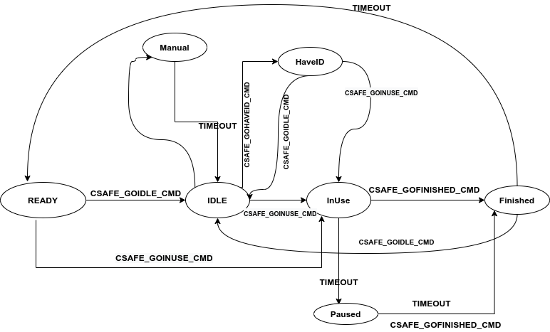

## PM5 Emulator

[](https://travis-ci.com/github/raralabs/pm5-emulator)

Emulating PM5 Rower via GATT server in BLE Device 


**Instructions to Run** 

Before starting the app, turn BLE service down: 
```
sudo hciconfig hci0 down 
```

Advertise your custom PM5 service (as emulator):
```cassandraql
sudo go run cmd/pm5-emulator/main.go 
```


**Common Errors**

*rf-kill errror* 
```cassandraql
 error while opening device 0: operation not possible due to RF-kill
```

This error is due to blocked bluetooth service. Try ```rfkill unblock bluetooth```


**PM5 State Diagram**




**Refs**

[PM5-Specs](https://www.concept2.co.uk/files/pdf/us/monitors/PM5_BluetoothSmartInterfaceDefinition.pdf)

[Intro to GATT](https://www.oreilly.com/library/view/getting-started-with/9781491900550/ch04.html)

[BLE Stack](https://www.mathworks.com/help/comm/examples/ble-l2cap-frame-generation-and-decoding.html)


